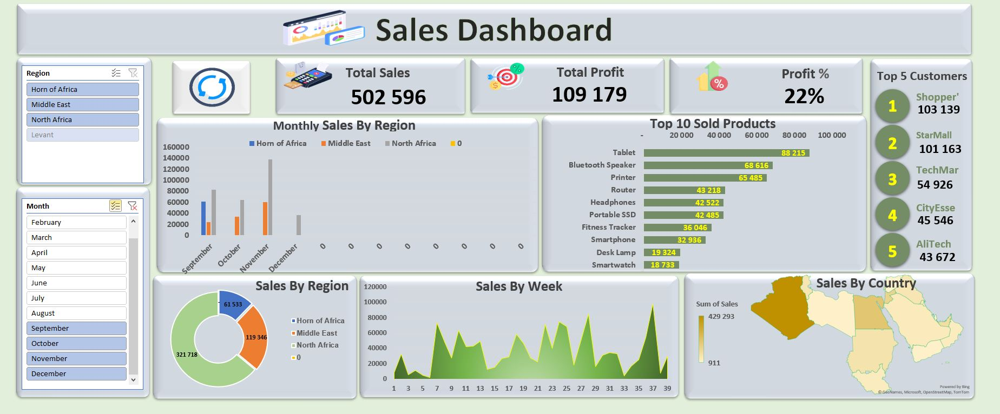
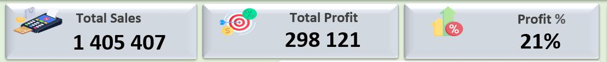
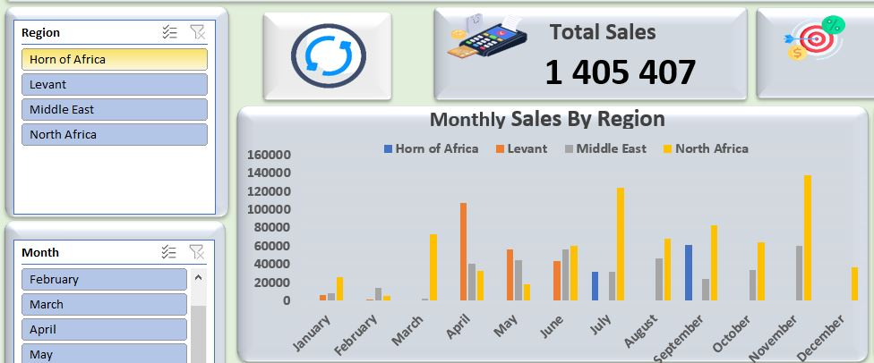
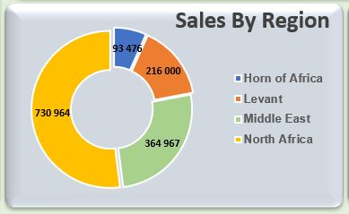
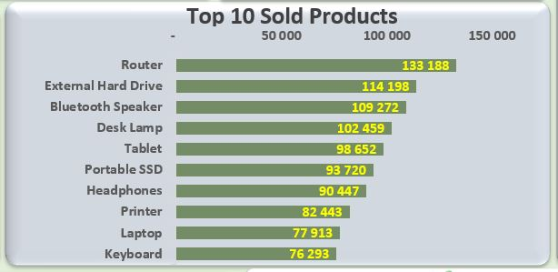
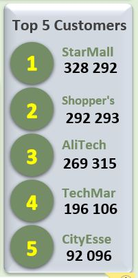
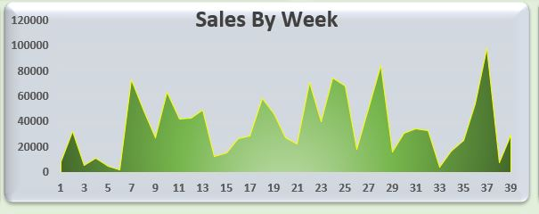
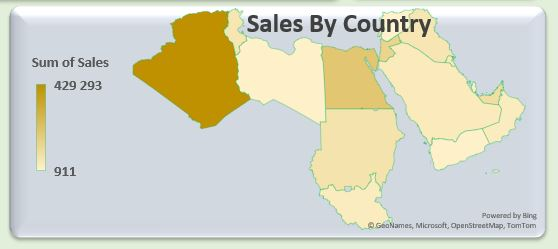
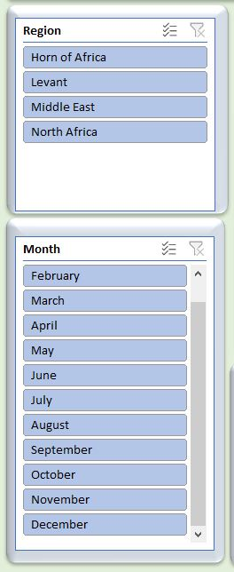
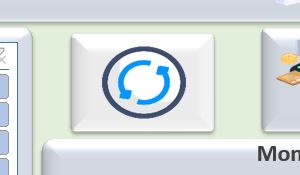

# Sales Dashboard Project

## Contents
- [Project Overview](#project-overview)
- [Use the Dashboard](#)
- [Dashboard Components](#dashboard-components)
- [Interactive Features](#interactive-features)
- [Technical Implementation](#technical-implementation)
- [Skills Demonstrated](#skills-demonstrated)
- [Documentation](#documentation)
- [Files Included](#files-included)
- [Acknowledgements](#acknowledgements)

## Project Overview
This repository contains a comprehensive interactive Sales Dashboard created in Microsoft Excel.  
The dashboard visualizes sales data from a retail electronics business operating across multiple regions in Africa and the Middle East.

## [Use the Dashboard](Sales%20Dashboard.xlsm)

  then click: View Raw
## Dashboard Components

### Key Performance Indicators (KPIs)
- Total Sales: 1,405,407
- Total Profit: 298,121
- Profit Margin: 21%

### Monthly Sales By Region Chart
Displays monthly sales performance across all regions with color-coding to distinguish each region.

### Regional Distribution Chart
Donut chart showing the proportional sales distribution across the four regions.

### Top 10 Products
Horizontal bar chart showing the best-performing products by sales volume.

### Top 5 Customers
Visual representation of the highest-value customers and their contribution to total sales.

### Weekly Sales Trend
Line chart displaying sales performance by week, helping identify patterns and peak periods.

### Geographical Sales Map
Visual representation of sales distribution across countries in Africa and the Middle East.

## Interactive Features

### Filter Controls
The dashboard includes two powerful slicer controls that allow for dynamic data filtering:
 **Region Slicer and Month Slicer**
   - Filter options: Horn of Africa, Levant, Middle East, North Africa
   - Filter options: All months from January to December
     
   

### Filter Impact on Dashboard Components

The slicers dynamically update the following dashboard elements when selections are made:

| Dashboard Component | Affected By Region Filter | Affected By Month Filter |
|---------------------|:-------------------------:|:------------------------:|
| KPI Metrics         | ✓                         | ✓                        |
| Monthly Sales Chart | ✓                         | ✓                        |
| Regional Distribution| ✓                        | ✓                        |
| Top 10 Products     | ✓                         | ✓                        |
| Top 5 Customers     | ✓                         | ✓                        |
| Weekly Sales Trend  | x                         | x                        |
| Geographical Map    | x                         | x                        |

### Refresh Functionality
The dashboard includes a Refresh button implemented with a simple macro that updates all data visualizations when clicked.

## Technical Implementation

### Excel Features Utilized
- **PivotTables & PivotCharts**: For dynamic data aggregation and visualization
- **Slicers**: For interactive filtering of dashboard components
- **Form Controls**: Including dropdown lists and buttons
- **Dashboard Layout Design**: Professional arrangement of visual elements
- **Data Validation**: For ensuring data integrity
- **Basic Macros**: Implementation of refresh functionality for dashboard updates

## Skills Demonstrated
- Interactive dashboard design and implementation
- Data visualization best practices
- Slicer implementation for dynamic filtering
- Chart creation and customization
- Data analysis and presentation
- Basic macro implementation
- Professional business reporting

## Documentation
- [Complete User Guide](HOW_TO_USE.md) - Detailed instructions for using this dashboard
- [Dashboard PDF View](Sales_Dashboard_veiw.pdf) - Static PDF version of the dashboard for quick reference

## Files Included
- `Sales_Dashboard.xlsx` - **it is a Microsoft Excel Macro-Enabled Worksheet file** and it is the complete Excel file with a dashboard and database
- `Sales_Dashboard_View.pdf` - PDF export of the dashboard view
- `HOW_TO_USE.md` - for using this dashboard
- ScreenShots folder - Images of dashboard components

## How to Use This Dashboard

### Basic Usage
1. Download the Excel file
2. Enable macros if prompted
3. Navigate to the "Dashboard" tab

### Working with Filters
1. Use the Region slicer to filter by geographical area
2. Use the Month slicer to analyze specific time periods
3. Multiple selections can be made in each slicer
4. All connected visualizations will update automatically

### Refreshing Data
If you make changes to the underlying database:
1. Click the Refresh button
2. All charts and metrics will update to reflect the new data

For complete instructions, see the [detailed user guide](HOW_TO_USE.md).

## Acknowledgements
Special thanks to Abderrahmane Ahmidatou for providing the dataset and guidance throughout the "Excel from Zero to Pro" course on Udemy, this is the [Link](https://www.udemy.com/course/excel-from-zero-to-pro/?couponCode=CP130525) of the course(in Arabic)

---
*Created by Saleem Khaled, May 2025*
